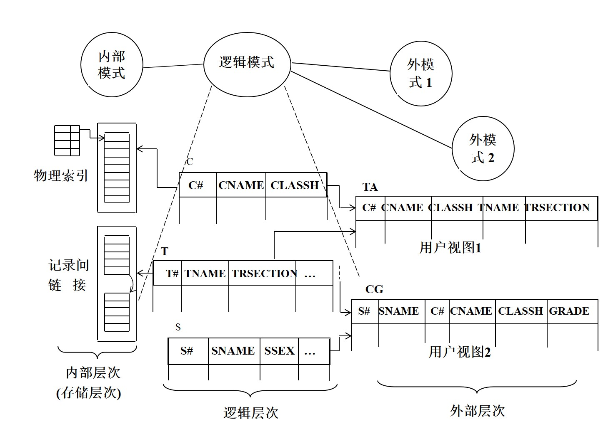
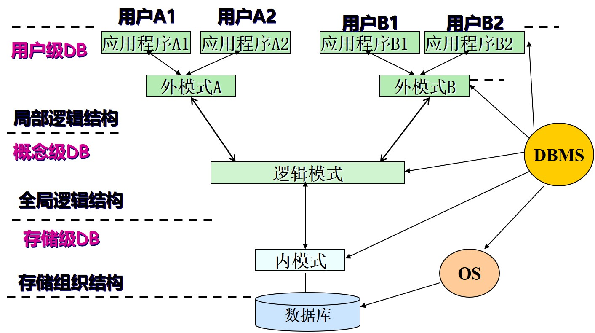

>## 数据库系统组成
&emsp;&emsp;数据库系统的组成涉及数据库管理系统(DataBase Management System, DBMS)、数据库应用系统(DataBase Application System, DBAS)和数据库(Data Base, DB)三个层次问题。
- **数据库**：是在计算机存储设备上，按一定的组织方式存储在一起的、相关的数据集合。
- **数据库管理系统(DBMS)**：是建立、管理和维护数据库的软件系统，是一种位于应用软件和操作系统之间，实现数据库管理功能的系统软件。其主要功能如下：
  - 定义数据库：利用自身提供的数据定义语言(DDL)定义数据库的外模式、逻辑模式和内模式；定义外模式与逻辑模式之间、逻辑模式与内模式之间的映射；定义有关的约束条件和访问规则等。
  - 操纵数据库：利用自身提供的数据操纵语言(DML)实现对数据库中的数据的查询、插入、删除、修改等操作。
  - 控制数据库：利用系统的控制机制，实现对数据库中数据的安全性、完整性和并发性等控制功能。
  - 维护数据库：利用系统的维护机制，实现对数据库中数据的转储、恢复、重组和性能监控等。
  - 通信功能：提供与操作系统、各功能部件和逻辑模块之间的数据传输缓冲机制与通信功能。
- **数据库应用系统**：是以计算机为开发和应用平台，以OS、DBMS、某种程序语言和实用程序等为软件环境，以某一应用领域的数据管理需求为应用背景，采用数据库设计技术建立的一个可实际运行的，按照数据库方法存储和维护数据的，并为用户提供数据支持和管理功能的应用软件系统。

<br/>

>## 关系模式
### **关系的基本概念**
- **关系**：每一个二维表格称为一个关系
- **属性**：表格中的每一列的列名称为属性(Attribute)
- **元组**：表中的每一行数据称为一个元组(Tuple)
- **元组分量**：元组在每一个属性上的取值称为该元组的元组分量，简称分量(Element)
- **属性值**：表中行和列的交会处的元素称为该行对应的元组在该列对应属性上的取值，简称为属性值，属性值相当于记录中的一个数据项。
- **值域**：某属性的取值范围称为该属性的值域(domain)
- 关系的状态：关系的状态即关系的实例(instance)，是指某个特定时刻关系的内容，有时也称为关系的当前值。
- 一个关系实例中的元组的个数，称为该关系实例的基数(Cardinal Number)

### **关系模式**
每个关系表的表头所描述的数据结构称为一个关系模式(relational Schema)。  
一个关系模式由一个关系名和该关系的属性名表构成，并一般地表示为：  
`关系名（属性名1，属性名2，... ，属性名n）`  
例如，课程关系模式可表示为：  
`课程（课程号，课程名，学时）`  

<br/>

>## 关系的键和关系的属性
- **候选键**：如果一个属性集能唯一地标识一个关系中的元组而又不含有多余的属性，则称该属性集为该关系的候选键(Candidate Key)。
- **主键**：当某关系模式只有一个候选键时，该候选键就是主键(Primary Key)；当某个关系模式有多个候选键时，被用户选用的那个候选键为主键。一般把主键简称为键(Key)。  
在任何时刻，关系的主键应具有以下特性（也即关系的约束条件）：
  - 唯一性：当给定某关系的主键属性集中的每一个属性一个确定的值时，该主键值只能唯一地确定该关系的一个元组。
  - 非冗余性：如果从主键属性集中抽去任一属性，则该属性集不再具有唯一性。
  - 有效性：主键中任一属性都不能为空值。
- **外键**：如果关系模式 R 中的某属性子集不是 R 的主键，而是另一关系模式$R_1$的主键，则该属性集是关系模式 R 的外键(Foreign Key)。例如：  
    ```
    专业（专业代码，专业名称）
    学生（学号，姓名，性别，出生年月，籍贯，专业代码，班级）
    ````
    “学生关系”中的属性“专业代码”是“专业关系”的主键，所以"专业代码”相对于“学生关系”来说是它的外键。  

- **主属性和非主属性**：包含在任何一个候选键中的属性称为主属性(Prime Attribute)。不属于任何候选键中的属性称为非主属性(Nonprime Attribute)或非键属性(Non-key Attribute)。

<br/>

>## 数据库的内部体系结构
### **三级模式结构**
&emsp;&emsp;从DBMS的角度看，数据库一般采用由外模式、逻辑模式和内模式组成的三级模型结构组织数据。  



1. **逻辑模式(Logical Schema)**：是对数据库中全部数据的整体逻辑结构的描述，包括多个关系模式，以及反映这些关系模式对应的数据完整性、安全性和数据控制方面的要求和描述。逻辑模式不涉及存储结构和访问技术等细节问题。
2. **外模式(External Schema)**：是对不同用户用到的那部分数据的逻辑描述，或者说是不同用户的数据视图；外模式也是应用程序员编写面向不同用户的应用程序时看到（运用）的数据库，反映了数据库中数据的局部逻辑结构。外模式又称为用户模式或用户视图。
3. **内模式(Internal Schema)**：是对逻辑模式中各个关系模式的存储结构的描述，定义了数据的内部存储方式，索引方式、数据聚簇方式和文件的组织方式等。也称为存储模式。



&emsp;&emsp;数据库的三级模式把数据库的内部体系结构分成了三级（如上图）。  
&emsp;&emsp;数据库三级模式结构之间的转换由外模式与逻辑模式之间的映像和逻辑模式与内模式之间的映像实现。DBMS的中心任务之一就是实现三级数据库模式之间的转换，把用户对数据库的操作转化到物理级去执行。