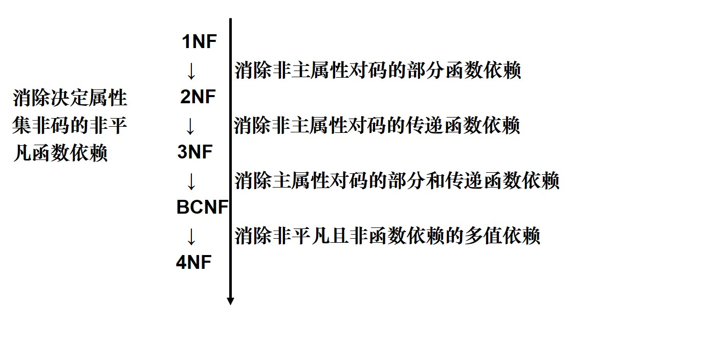

### **关系模式的表示**
一个关系模式应该完整地用一个五元组$\{R,U,D,DOM,F\}$表示，一般记为  
$\{R(U,D,DOM,F)\}$
其中，R是关系名；U是组成该关系的属性名集合；D是U中各属性的值域的集合；DOM是属性向域的映象集合；F是属性间数据的函数依赖集合。  
单一的关系模式 ：$Student(U，F)$   
　　$U=\{ Sno, Sdept, Mname, Cname, Grade \}$  
属性组U上的一组函数依赖F：  
    $F=\{Sno \rightarrow Sdept,  Sdept \rightarrow Mname,(Sno, Cname) \rightarrow Grade\}$

 

>## 函数依赖
**定义** &emsp; 设有关系模式$R(A_1，A_2，\dots，A_n)$和属性集$U=\{A_1，A_2，\dots，A_n\}$的子集X、Y。如果对于具体关系r的任何两个元组$u$和$v$，只要$u[X]=v[X]$，就有$u[Y]=v[Y]$，则称$X$函数决定$Y$，或$Y$函数依赖$X$，记为$X \rightarrow Y$。  
- 平凡函数依赖：$X \rightarrow Y，Y \subseteq X$。必然成立
- 非平凡函数依赖：$X \rightarrow Y，Y \subsetneq X$。若不特别声明，总假定为非平凡函数依赖。
- 完全函数依赖：在$R(U)$中，如果$X \rightarrow Y$，并且对于$X$的任何一个真子集$X'$，都有$X' \nrightarrow Y$, 则称Y对X完全函数依赖，记作$X \stackrel{F}{\rightarrow} Y$。
- 部分函数依赖：若$X \rightarrow Y$，但$Y$不完全函数依赖于$X$，则称$Y$对$X$部分函数依赖，记作$X \stackrel{P}{ \rightarrow}Y$。
- 传递函数依赖：在关系模式$R(U)$中，如果$X \rightarrow Y，Y \rightarrow Z$，且$Y \subsetneq X，Y \nrightarrow X$，则称$Z$传递函数依赖于$X$，记作$X \stackrel{T}{ \rightarrow}Z$。
- 码：设$K$为关系模式$R<U,F>$中的属性或属性组合。若$K \stackrel{F}{\rightarrow} U$，则$K$称为$R$的一个**侯选码(Candidate Key)**。若关系模式$R$有多个候选码，则选定其中的一个做为**主码(Primary key)**。
- **主属性(Prime attribute)**：一个属性只要在任何一个候选码中出现过，这个属性就是主属性
- **非主属性(Non-key attribute)**：与上面相反，没有在任何候选码中出现过，这个属性就是非主属性。
- 全码(ALL KEY)：关系模式的所有属性是这个关系模式的候选码。

 

>## 范式
[https://www.zhihu.com/question/24696366/answer/29189700]  
[https://blog.csdn.net/legendaryhaha/article/details/80032808]  

 
### **范式的联系**
各种范式之间存在联系：
$1NF \supset 2NF \supset 3NF \supset BCNF \supset 4NF \supset 5NF$  
某一关系模式R为第n范式，可简记为$R \in nNF$。  

1. 第一范式：如果一个关系模式$R$的所有属性都是不可分的基本数据项，则$R \in 1NF$。
2. 第二范式：若关系模式$R \in 1NF$，并且每一个非主属性都完全函数依赖于$R$的码，则$R \in 2NF$。
3. 第三范式：若关系模式$R \in 2NF$，并且不存在非主属性对于码的传递函数依赖，则$R \in 3NF$。
4. BC范式：若R上的每一个函数依赖中的决定因素都是候选键，则$R \in BCNF$