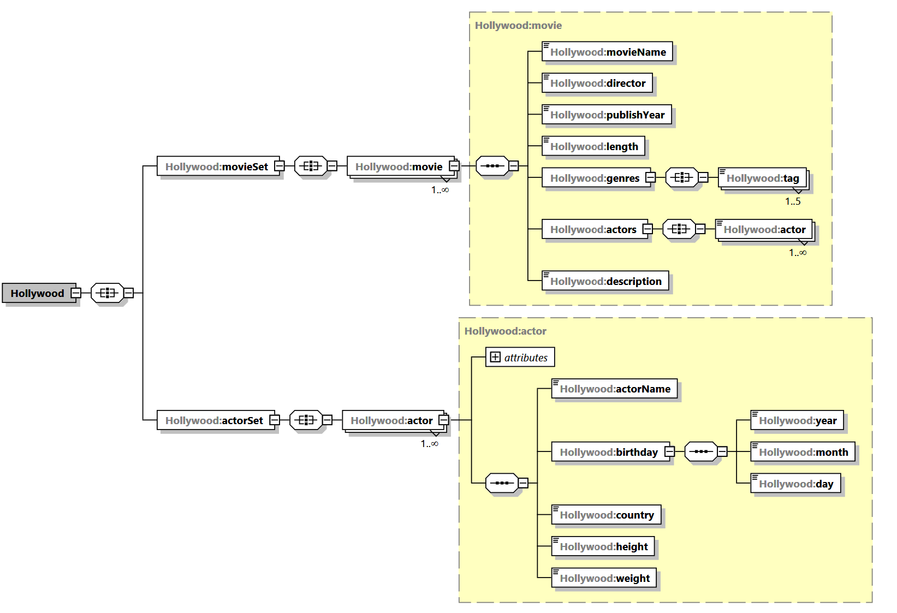
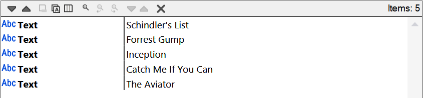
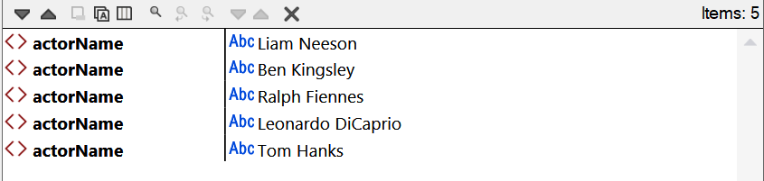
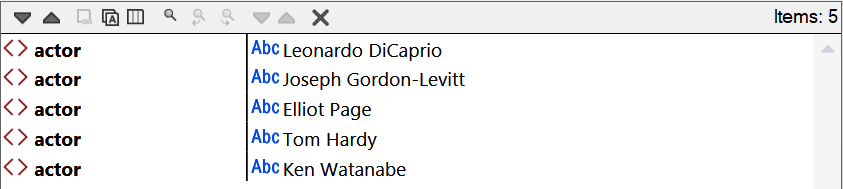
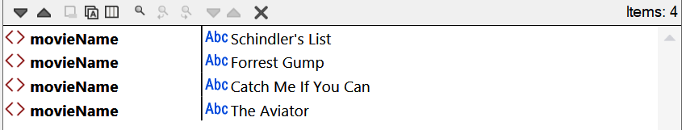
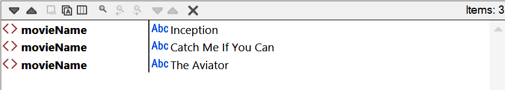
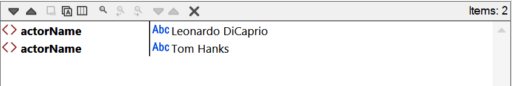
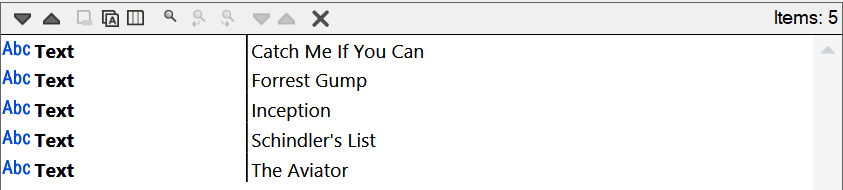
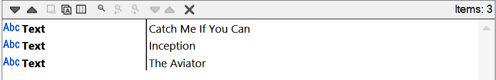
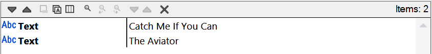

# XML

## 构建XML Schema
```xml
<?xml version="1.0" encoding="UTF-8"?>
<xs:schema xmlns:xs="http://www.w3.org/2001/XMLSchema" xmlns:vc="http://www.w3.org/2007/XMLSchema-versioning" vc:minVersion="1.1" elementFormDefault="qualified" attributeFormDefault="unqualified" xmlns:Hollywood="urn:Hollywood" targetNamespace="urn:Hollywood">
    <xs:element name="Hollywood">
        <xs:complexType>
            <xs:all>
                <xs:element name="movieSet">
                    <xs:complexType>
                        <xs:all>
                            <xs:element name="movie" type="Hollywood:movie" maxOccurs="unbounded"/>
                        </xs:all>
                    </xs:complexType>
                </xs:element>
                <xs:element name="actorSet">
                    <xs:complexType>
                        <xs:all>
                            <xs:element name="actor" type="Hollywood:actor" maxOccurs="unbounded"/>
                        </xs:all>
                    </xs:complexType>
                </xs:element>
            </xs:all>
        </xs:complexType>
    </xs:element>
    <xs:complexType name="movie">
        <xs:sequence>
            <xs:element name="movieName" type="xs:string"/>
            <xs:element name="director" type="xs:string"/>
            <xs:element name="publishYear" type="Hollywood:year"/>
            <xs:element name="length" type="xs:integer"/>
            <xs:element name="genres">
                <xs:complexType>
                    <xs:all>
                        <xs:element name="tag" type="xs:string" maxOccurs="5"/>
                    </xs:all>
                </xs:complexType>
            </xs:element>
            <xs:element name="actors">
                <xs:complexType>
                    <xs:all>
                        <xs:element name="actor" type="xs:string" maxOccurs="unbounded"/>
                    </xs:all>
                </xs:complexType>
            </xs:element>
            <xs:element name="description" type="xs:string"/>
        </xs:sequence>
    </xs:complexType>
    <xs:complexType name="actor">
        <xs:sequence>
            <xs:element name="actorName" type="xs:string"/>
            <xs:element name="birthday">
                <xs:complexType>
                    <xs:sequence>
                        <xs:element name="year" type="Hollywood:year"/>
                        <xs:element name="month" type="Hollywood:month"/>
                        <xs:element name="day" type="Hollywood:day"/>
                    </xs:sequence>
                </xs:complexType>
            </xs:element>
            <xs:element name="country" type="xs:string"/>
            <xs:element name="height" type="xs:integer"/>
            <xs:element name="weight" type="xs:integer"/>
        </xs:sequence>
        <xs:attribute name="gender" use="required">
            <xs:simpleType>
                <xs:restriction base="xs:string">
                    <xs:enumeration value="male"/>
                    <xs:enumeration value="female"/>
                    <xs:enumeration value="unknown"/>
                </xs:restriction>
            </xs:simpleType>
        </xs:attribute>
    </xs:complexType>
    
    <xs:simpleType name="year">
        <xs:restriction base="xs:integer">
            <xs:minInclusive value="1900"/>
            <xs:maxInclusive value="2100"/>
        </xs:restriction>
    </xs:simpleType>
    <xs:simpleType name="month">
        <xs:restriction base="xs:integer">
            <xs:minInclusive value="1"/>
            <xs:maxInclusive value="12"/>
        </xs:restriction>
    </xs:simpleType>
    <xs:simpleType name="day">
        <xs:restriction base="xs:integer">
            <xs:minInclusive value="1"/>
            <xs:maxInclusive value="31"/>
        </xs:restriction>
    </xs:simpleType>
</xs:schema>
```
&nbsp;

#### Schema的结构：

&nbsp;

## 构建XML
```xml
<?xml version="1.1" encoding="UTF-8"?>
<Hollywood xmlns="urn:Hollywood" xmlns:xsi="http://www.w3.org/2001/XMLSchema-instance" xsi:schemaLocation="urn:Hollywood movie.xsd">
    <movieSet>
        <movie>
            <movieName>Schindler's List</movieName>
            <director>Steven Spielberg</director>
            <publishYear>1993</publishYear>
            <length>195</length>
            <genres>
                <tag>Biography</tag>
                <tag>Drama</tag>
                <tag>History</tag>
            </genres>
            <actors>
                <actor>Liam Neeson</actor>
                <actor>Ben Kingsley</actor>
                <actor>Ralph Fiennes</actor>
                <actor>Caroline Goodall</actor>
            </actors>
            <description>In German-occupied Poland during World War II, industrialist Oskar Schindler gradually becomes concerned for his Jewish workforce after witnessing their persecution by the Nazis.</description>
        </movie>
        <!-- For more data, see https://github.com/xxyLiang/Public/blob/master/XML/Hollywood.xml  -->
    </movieSet>
    
    <actorSet>
        <actor gender="male">
            <actorName>Liam Neeson</actorName>
            <birthday>
                <year>1952</year>
                <month>6</month>
                <day>7</day>
            </birthday>
            <country>Ireland</country>
            <height>193</height>
            <weight>80</weight>
        </actor>
        <!-- For more data, see https://github.com/xxyLiang/Public/blob/master/XML/Hollywood.xml  -->
    </actorSet>
</Hollywood>
```
&nbsp;

## 查询XML数据
#### (1) 查询所有电影的名称
```python
/Hollywood/movieSet/movie/movieName/text()
# 使用/text()来获取电影字符串，如果省略，则获取到movieName整个元素，如下面其他查询
```
查询结果：

&nbsp;

#### (2) 查询所有男性演员的姓名
```python
/Hollywood/actorSet/actor[@gender="male"]/actorName
```
查询结果：

&nbsp;

#### (3) 查询电影《Inception》的演员
```python
//movie[movieName="Inception"]/actors/actor
```
查询结果：

&nbsp;

#### (4) 查询电影类型包含“戏剧”的电影名称
```python
//genres[tag="Drama"]/../movieName
```
查询结果：

&nbsp;

#### (5) 查询2000年以后上映的电影名称
```python
//movie[publishYear>=2000]/movieName
```
查询结果：

&nbsp;

#### (6) 查询所有美国演员的姓名
```python
//actor[country="America"]/actorName
```
查询结果：

&nbsp;

#### (7) 使用FLWOR查询所有电影的名称
```xquery
for $movie in /Hollywood/movieSet/movie 
order by $movie/movieName
return $movie/movieName/text()
```
查询结果：

&nbsp;

#### (8) 使用FLWOR查询小李子出演的电影
```xquery
for $movie in //movie
where $movie//actor="Leonardo DiCaprio"
order by $movie/movieName
return $movie/movieName/text()
```
查询结果：

&nbsp;

#### (9) 使用FLWOR查询小李子出演的传记类型电影
```xquery
for $movie in //movie
where $movie//actor="Leonardo DiCaprio" and $movie//tag="Biography"
order by $movie/movieName
return $movie/movieName/text()
```
查询结果：

&nbsp;