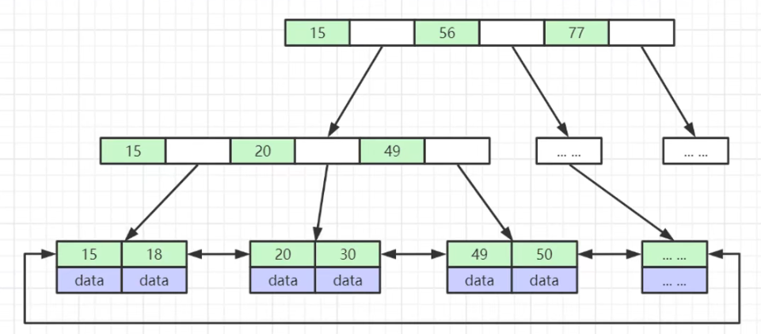

### 索引

**索引**是帮助MySQL高效获取数据的**排好序**的**数据结构**

索引数据结构

- 二叉树
- 红黑树
- Hash表
- B树

红黑树缺点：数据量大时树太高，一个结点只放一个数，随机IO多

B+树：

- 非叶子节点不存储data，只存储索引（冗余），可以放更多索引
- 叶子节点包含所有索引字段
- 叶子节点用指针连接，提高区间访问的性能（MySQL中是双向指针）

MySQL每个页默认为16KB，一个页可以放1000+个元素（一个bigint8字节，一个指针6字节）

**B树和B+树的区别：**

- B树的非叶子节点既存储索引（指针）也存储数据
- B树的叶子节点间没有指针连接

 

**Hash**

- 对索引的key进行一次hash计算就可以定位出数据存储的位置
- 很多时候Hash索引要比B+树索引更高效
- 仅能满足“=”、“IN”，**不支持范围查询**（不常使用Hash索引的主要原因）
- hash冲突问题

 

MyIASM引擎，B+树的数据结构中存储的内容实际上是实际数据的地址值。也就是说它的索引和实际数据是分开的，只不过使用索引指向了实际数据。这种索引的模式被称为**非聚集索引**。

Innodb引擎的索引的数据结构也是B+树，只不过叶子节点中存储的都是实际的数据，这种索引有被称为**聚集索引**。非主键索引结构叶子节点存储的是主键值，所以建议InnoDB表必须建主键（否则会自动建），并且推荐使用整型的自增主键（自增使得插入的时候只会在叶子节点链最后插入，如果要插入到中间，可能会引起索引树的大量调整）。

 

**索引的分类**

- 主键索引：唯一性索引
- 唯一索引：索引列的所有值都只能出现一次
- 普通索引：基本的索引类型，值可以为空，没有唯一性的限制。
- 全文索引：FULLTEXT，可以在varchar、char、text类型的列上创建
- 组合索引：多列值组成一个索引，专门用于组合搜索。

 

**组合索引**

最左前缀原则

### 事务的特性

#### 原子性（atomicity)

&emsp;&emsp;一个事务要么全部提交成功，要么全部失败回滚，不能只执行其中的一部分操作，这就是事务的原子性

#### 一致性（consistency)

&emsp;&emsp;事务的执行不能破坏数据库数据的完整性和一致性，一个事务在执行之前和执行之后，数据库都必须处于一致性状态。
&emsp;&emsp;如果数据库系统在运行过程中发生故障，有些事务尚未完成就被迫中断，这些未完成的事务对数据库所作的修改有一部分已写入物理数据库，这是数据库就处于一种不正确的状态，也就是不一致的状态

#### 隔离性（isolation）

&emsp;&emsp;事务的隔离性是指在并发环境中，并发的事务时相互隔离的，一个事务的执行不能不被其他事务干扰。不同的事务并发操作相同的数据时，每个事务都有各自完成的数据空间，即一个事务内部的操作及使用的数据对其他并发事务时隔离的，并发执行的各个事务之间不能相互干扰。

#### 持久性（durability）

&emsp;&emsp;一旦事务提交，那么它对数据库中的对应数据的状态的变更就会永久保存到数据库中。--即使发生系统崩溃或机器宕机等故障，只要数据库能够重新启动，那么一定能够将其恢复到事务成功结束的状态。

### 杂项

#### count(*)、count(1)、count(字段)

**从执行结果来说：**

count（1）和count（*）之间没有区别，因为count（*）count（1）都不会去过滤空值，但count（列名）就有区别了，因为count（列名）会去过滤空值。

从执行效率来说：

​     他们之间根据不同情况会有些许区别，MySQL会对count（*）做优化。

​     （1）如果列为[主键](https://so.csdn.net/so/search?q=主键&spm=1001.2101.3001.7020)，count(列名)效率优于count(1)  

​     （2）如果列不为主键，count(1)效率优于count(列名)  

​     （3）如果表中存在主键，count(主键列名)效率最优  

​     （4）如果表中只有一列，则count(*)效率最优  

​     （5）如果表有多列，且不存在主键，则count(1)效率优于count(*)
 

补充：

count(1)，其实就是计算一共有多少符合条件的行。

1并不是表示第一个字段，而是表示一个固定值。

其实就可以想成表中有这么一个字段，这个字段就是固定值1，count(1)，就是计算一共有多少个1。

count(*)，执行时会把星号翻译成字段的具体名字，效果也是一样的，不过多了一个翻译的动作，比固定值的方式效率稍微低一些。

