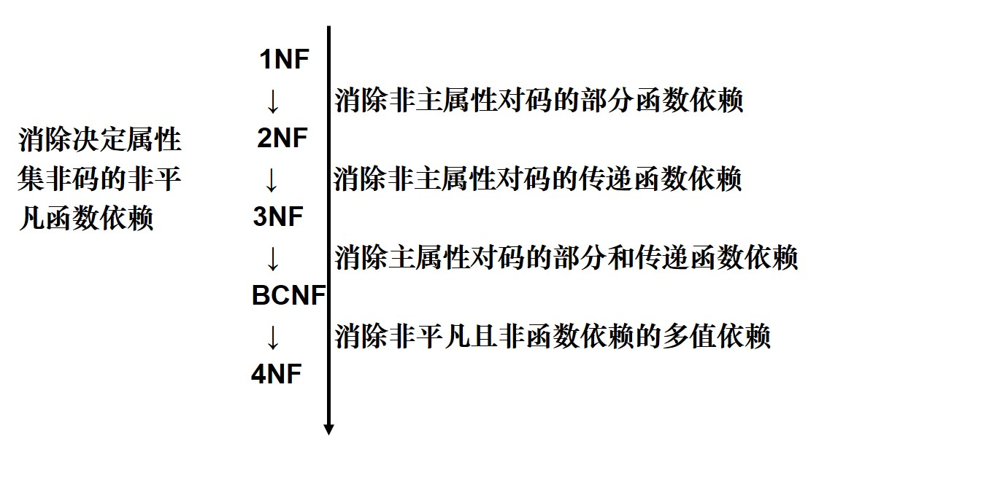

### 范式

**1NF：每个属性都不可再分**（e.g. 销售额=件数*单价）

**2NF：消除了非主属性对于码的部分函数依赖。**（非主属性即码以外的属性，只要非主属性可以由码的一部分决定，那就不符合2NF；从而，如果码只有一个属性，那么必定满足2NF）

**3NF：消除了非主属性对于码的传递函数依赖。**（A是码，B、C是非主属性，若A→B→C，那么C传递函数依赖于A，不符合3NF）

**BCNF：消除了主属性对于码的部分和传递函数依赖。**




### 索引

**索引**是帮助MySQL高效获取数据的**排好序**的**数据结构**

索引数据结构

- 二叉树
- 红黑树
- Hash表
- B树

红黑树缺点：数据量大时树太高，一个结点只放一个数，随机IO多

B+树：

- 非叶子节点不存储data，只存储索引（冗余），可以放更多索引
- 叶子节点包含所有索引字段
- 叶子节点用指针连接，提高区间访问的性能（MySQL中是双向指针）

MySQL每个页默认为16KB，一个页可以放1000+个元素（一个bigint8字节，一个指针6字节）


**B树和B+树的区别：**

- B树的非叶子节点既存储索引（指针）也存储数据
- B树的叶子节点间没有指针连接

 

**Hash**

- 对索引的key进行一次hash计算就可以定位出数据存储的位置
- 很多时候Hash索引要比B+树索引更高效
- 仅能满足“=”、“IN”，**不支持范围查询**（不常使用Hash索引的主要原因）
- hash冲突问题：解决办法：
  - 链地址法：对于相同的哈希值，使用链表进行连接。（**HashMap使用此法**）
  - 再哈希法：提供多个哈希函数，如果第一个哈希函数计算出来的key的哈希值冲突了，则使用第二个哈希函数计算key的哈希值。
  - 建立公共溢出区：将哈希表分为基本表和溢出表两部分，凡是和基本表发生冲突的元素，一律填入溢出表。
  - 开放定址法


MyIASM引擎，B+树的数据结构中存储的内容实际上是实际数据的地址值。也就是说它的索引和实际数据是分开的，只不过使用索引指向了实际数据。这种索引的模式被称为**非聚集索引**。

Innodb引擎的索引的数据结构也是B+树，只不过叶子节点中存储的都是实际的数据，这种索引有被称为**聚集索引**。非主键索引结构叶子节点存储的是主键值，所以建议InnoDB表必须建主键（否则会自动建），并且推荐使用整型的自增主键（自增使得插入的时候只会在叶子节点链最后插入，如果要插入到中间，可能会引起索引树的大量调整）。

 

**索引的分类**

- 主键索引：唯一性索引
- 唯一索引：索引列的所有值都只能出现一次
- 普通索引：基本的索引类型，值可以为空，没有唯一性的限制。
- 全文索引：FULLTEXT，可以在varchar、char、text类型的列上创建
- 组合索引：多列值组成一个索引，专门用于组合搜索。

 

**组合索引**

最左前缀原则


### 事务的特性

**原子性（atomicity）**：事务是一个原子操作单元，对其数据的修改，要么全都执行，要么全都不执行。

**一致性（consistency）**：在事务开始和完成时，数据都必须保持一致状态。这意味着所有相关的数据规则都必须应用于事务的修改，以保持数据的完整性。

**隔离性（isolation）**：数据库系统提供一定的隔离机制，保证事务在不受外部并发操作影响的“独立”环境执行，这意味着事务处理过程中的中间状态对外部是不可见的，反之亦然。

**持久性（durability）**：事务完成之后，它对于数据的修改是永久性的，即使出现系统故障也能够保持。


### 锁

- **从性能上分为乐观锁和悲观锁**

- **从对数据库操作的类型分，分为读锁和写锁（都属于悲观锁）**

  - 读锁（共享锁，S锁）：针对同一份数据，多个读操作可以同时进行而不会互相影响
  - 写锁（排它锁，X锁）：当前写操作没有完成前，它会阻断其他写锁和读锁

- **从对数据操作的粒度分，分为表锁和行锁。**

  - 表锁：每次操作锁住整张表。开销小，加锁快；不会出现死锁；锁定粒度大，发生锁冲突的概率最高，并发度最低；一般用在整表数据迁移的场景。

  - 行锁：每次操作锁住一行数据。开销大，加锁慢；会出现死锁。InnoDB支持行锁，MyISAM不支持。行锁在InnoDB中是基于**索引**实现的，所以一旦某个加锁操作没有使用索引，那么该锁就会退化为**表锁**。

**总结**

1. MyISAM在执行查询语句SELECT前，会自动给涉及的所有表加读锁，在执行update、insert、delete操作会自动给涉及的表加写锁。

2. InnoDB在执行查询语句SELECT时，因为有mvcc机制不会加锁，但是在update、insert、delete操作会加行锁。

</br>

**间隙锁**（Gap Locks）

间隙锁基于非唯一索引，它锁定一段范围内的索引记录，锁住的是一个区间，而不仅仅是这个区间中的每一条数据。

例如现表里有id=(1,2,3,10,20)的五条记录，那么间隙就有id为(3,10)，(10,20)，(20,+∞)三个区间（注意是开区间）。执行 ```update t set a=100 where id>=11 and id<=20```，则其他Session无法在(10,20)里插入或修改任何数据。间隙锁仅在可重复读隔离级别下生效。

**临键锁**（Next-key Locks）

是行锁和间隙锁的组合，会锁住一段**左开右闭区间**的数据，例如上面会锁住(10,20]。（测试时好像还会锁20后一个区间，存疑）

</br>

**锁优化建议**

- 尽可能让所有数据检索都通过索引来完成，避免行锁升级为表锁。
- 合理设计索引，尽量缩小锁的范围。
- 尽可能减少检索条件范围，避免间隙锁
- 尽量控制事务大小，减少锁定资源量和时间长度，涉及事务加锁的sql尽量放在事务最后执行。
- 尽可能低级别事务隔离。

</br>

### 隔离级别

| 隔离级别         | 脏读   | 不可重复读 | 幻读   |
| ---------------- | ------ | ---------- | ------ |
| READ_UNCOMMITTED | 可能   | 可能       | 可能   |
| READ_COMMITTED   | 不可能 | 可能       | 可能   |
| REPEATABLE_READ  | 不可能 | 不可能     | 可能   |
| SERIALIZABLE     | 不可能 | 不可能     | 不可能 |

- **脏读**：事务A向表中插入了一条数据，此时事务A还没有提交，此时查询语句能把这条数据查询出来，这种现现象称为脏读；脏读比较好理解
- **不可重复读**：一个事务A第一次读取的结果之后， 另外一个事务B更新了A事务读取的数据，A事务在第二次读取的结果和第一次读取的结果不一样这种现象称为不可重复读
- **幻读**：事务A读取到了事务B提交的新增数据，不符合隔离性。

 

**MySQL解决REPEATABLE_READ下的幻读**

- 在快照读情况下，MySQL通过mvcc来避免幻读。
- 在当前读情况下，MySQL通过next-key来避免幻读

 

**普通的查询是快照读**，是不会看到别的事务插入的数据的。

可重复读隔离级是由 MVCC（多版本并发控制）实现的，实现的方式是启动事务后，在执行第一个查询语句后，会创建一个视图，然后后续的查询语句都用这个视图，「快照读」读的就是这个视图的数据，视图你可以理解为版本数据，这样就使得每次查询的数据都是一样的。

**MySQL 里除了普通查询是快照度，其他都是当前读，比如update、insert、delete**，这些语句执行前都会查询最新版本的数据，然后再做进一步的操作。


### 存储引擎

mysql的存储引擎

| **功  能**   | **MyISAM** | **InnoDB** | **Memory** | **Archive** |
| :----------- | ---------- | ---------- | ---------- | ----------- |
| 存储限制     | 256TB      | 64TB       | RAM        | None        |
| 支持事务     | No         | Yes        | No         | No          |
| 支持全文索引 | Yes        | No         | No         | No          |
| 支持数索引   | Yes        | Yes        | Yes        | No          |
| 支持哈希索引 | No         | No         | Yes        | No          |
| 支持数据缓存 | No         | Yes        | N/A        | No          |
| 支持外键     | No         | Yes        | No         | No          |

- **InnoDB**：如果需要事务支持（提交、回滚、崩溃恢复能力的事物安全（ACID兼容）能力），并且有较高的并发读取频率，InnoDB是一个好的选择
- **MyISAM**：由于不支持事务，因此当执行Insert插入和Update更新语句时，即执行写操作的时候需要锁定这个表。如果数据表主要用来插入和查询记录，读操作比写操作多，则MyISAM引擎能提供较高的处理效率
- **Memory**：如果只是临时存放数据，数据量不大，并且不需要较高的数据安全性，可以选择将数据保存在内存中的Memory引擎，MySQL中使用该引擎作为临时表，存放查询的中间结果
- **Archive**：如果只有INSERT和SELECT操作，可以选择Archive，Archive支持高并发的插入操作，但是本身不是事务安全的。Archive非常适合存储归档数据，如记录日志信息可以使用Archive。（在MySQL 5.5版以前，Archive是不支持索引，但是在MySQL 5.5以后的版本中就开始支持索引了。）

使用哪一种引擎需要灵活选择，**一个数据库中多个表可以使用不同引擎以满足各种性能和实际需求**，使用合适的存储引擎，将会提高整个数据库的性能


### 杂项

#### count(1|*|字段) 的区别

**从执行结果来说：**

count（1）和count（\*）之间没有区别，因为count（\*）count（1）都不会去过滤空值，但count（列名）就有区别了，因为count（列名）会去过滤空值。

从执行效率来说：

​     他们之间根据不同情况会有些许区别，MySQL会对count（*）做优化。

​     （1）如果列为[主键](https://so.csdn.net/so/search?q=主键&spm=1001.2101.3001.7020)，count(列名)效率优于count(1)  

​     （2）如果列不为主键，count(1)效率优于count(列名)  

​     （3）如果表中存在主键，count(主键列名)效率最优  

​     （4）如果表中只有一列，则count(*)效率最优  

​     （5）如果表有多列，且不存在主键，则count(1)效率优于count(*)


补充：

- count(1)，其实就是计算一共有多少符合条件的行。1并不是表示第一个字段，而是表示一个固定值。其实就可以想成表中有这么一个字段，这个字段就是固定值1，count(1)，就是计算一共有多少个1。

- count(*)，执行时会把星号翻译成字段的具体名字，效果也是一样的，不过多了一个翻译的动作，比固定值的方式效率稍微低一些。


#### 数据切分（水平切分、垂直切分）

概念：指通过某种特定的条件，将同一个数据库中的数据分散存放到多个数据库（主机）上面，达到分散单台设备负载的效果。

1. **垂直拆分**

   按照不同的表（或者Schema）切分到不同的数据库（主机）上。一个数据库由很多表构成，每张表对应不同的业务，垂直切分是按照业务将表进行分类，分布到不同数据库上。

   优点：

   - 拆分后业务清晰，拆分规则明确
   - 系统间整合或扩展容易
   - 数据维护简单

    缺点：

   - 部分业务表（很难独立）无法join  ，只能通过接口方式解决，提高系统复杂度
   - 受每种业务不同的限制存在单库性能瓶颈，不易数据扩展和性能提高
   - 事务处理复杂

2. **水平切分**

   根据表中数据的逻辑关系，将同一个表中的数据按照某种条件拆分到多台数据库（主机）上。

   几种典型的分片规则包括：

   - 按照用户ID求模，将数据分散到不同库，相同数据用户的数据被分到一个库中
   - 按照日期划分
   - 按照某个特定字段求模或根据特定范围划分

   优点：

   - 拆分规则抽象好，数据库可以做join操作
   - 不存在单库大数据，高并发的性能瓶颈
   - 应用端改造较少
   - 提高了系统的稳定性和负载能力

   缺点：

   - 拆分规则难以抽象
   - 分片事务一致性难以解决
   - 数据多次扩展难度和维护量极大
   - 跨库join性能较差


#### 执行顺序

**from > join > where > group by > 聚合函数 > having > select > distinct > order by > limit**
