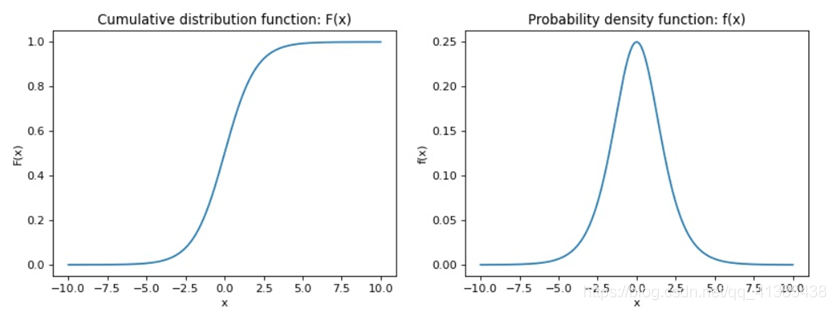
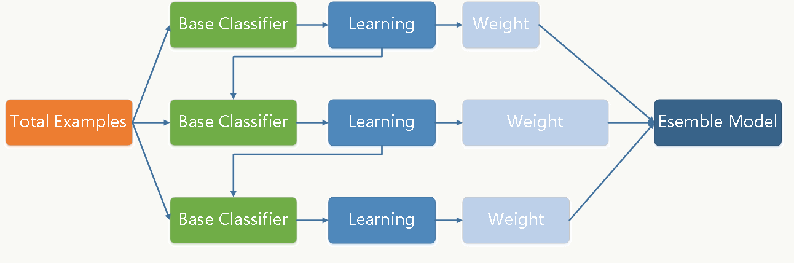

### 数据预处理

- 聚集

- 抽样

- 维归约

- 特征子集选择

- 特征创建

- - 特征提取（高度针对特定领域，比如NLP里面的各种词汇数量的特征）
  - 数据映射（傅里叶变换、小波变换）
  - 特征构造（密度=体积/质量）

- 离散化和二元化

- 变量变换（函数转换和标准化两种）

#### 特征选择

特征选择也称特征子集选择，是指从全部特征中选取一个特征子集，使构造出来的模型更好。特征选择能剔除不相关或冗余的特征，从而达到减少特征个数，提高模型精确度，减少运行时间的目的。另一方面，选取出真正相关的特征简化了模型，使研究人员易于理解数据产生的过程。

1. **完全搜索**：分为穷举搜索和非穷举搜索
   - **广度优先搜索**：广度优先遍历特征子空间。评价：枚举了所有的特征组合，属于穷举搜索，时间复杂度是 $O(2n)$ ，实用性不高。
   - **分支限界搜索**：在穷举搜索的基础上加入分支限界。例如：若断定某些分支不可能搜索出比当前找到的最优解更优的解，则可以剪掉这些分支。
   - **定向搜索**：首先选择N个得分最高的特征作为特征子集，将其加入一个限制最大长度的优先队列，每次从队列中取出得分最高的子集，然后穷举向该子集加入1个特征后产生的所有特征集，将这些特征集加入队列。
   - **最优优先搜索**：与定向搜索类似，唯一的不同点是不限制优先队列的长度。
2. **启发式搜索**：
   - **序列前向选择**：特征子集X从空集开始，每次选择一个特征x加入特征子集X，使得特征函数 $J(X)$ 最优，是一种简单的贪心算法。
   - **序列后向选择**：从特征全集O开始，每次从特征集O中剔除一个特征x，使得剔除特征x后评价函数值达到最优。前向和后向选择都容易陷入局部最优解。
   - **双向搜索**：使用序列前向选择(SFS)从空集开始，同时使用序列后向选择(SBS)从全集开始搜索，当两者搜索到一个相同的特征子集C时停止搜索。
   - **增L去R选择算法**：
     - 算法从空集开始，每轮先加入L个特征，然后从中去除R个特征，使得评价函数值最优。( L > R )
     - 算法从全集开始，每轮先去除R个特征，然后加入L个特征，使得评价函数值最优。( L < R )
   - **序列浮动选择**：由增L去R选择算法发展而来，该算法与增L去R选择算法的不同之处在于：序列浮动选择的L与R不是固定的，而是“浮动”的，也就是会变化的。
3. **随机算法**：
   - **随机产生序列选择算法**：随机产生一个特征子集，然后在该子集上执行SFS与SBS算法。可作为SFS与SBS的补充，用于跳出局部最优值。
   - **模拟退火算法**
   - **遗传算法**

#### 数据变换

归一化： $x'=\frac{x-min(x)}{max(x)-min(x)}$

标准化： $x'=\frac{x-\bar{x}}{\sigma}$

中心化： $x'=x-\bar{x}$ ，变换后特征x'的均值为0

log变换 ： $x'=\frac{log(x)}{log(max(x))}$

sigmoid变换： $x'=\frac{1}{1+e^{-x}}$

softmax变换： $x'=\frac{e^x}{Σ_{i=1}^n e^{x_i}}$

##### 归一化和标准化的区别

- 归一化是将样本的特征值转换到同一量纲下把数据映射到[0,1]或者[-1, 1]区间内，仅由变量的极值决定，因区间放缩法是归一化的一种。
- 标准化是依照特征矩阵的列处理数据，其通过求z-score的方法，会改变数据分布（均值和标准差改变，但分布类型不变），和整体样本分布相关，每个样本点都能对标准化产生影响。
- 它们的相同点在于都能取消由于量纲不同引起的误差；都是一种线性变换，都是对向量X按照比例压缩再进行平移。

##### 归一化和标准化的原因、用途

1. 统计建模中，如回归模型，自变量 $X$ 的量纲不一致导致了回归系数无法直接解读或者错误解读；需要将 $X$ 都处理到统一量纲下，这样才可比；
2. 机器学习任务和统计学任务中有很多地方要用到“距离”的计算，比如PCA，比如KNN，比如kmeans等等，假使算欧式距离，不同维度量纲不同可能会导致距离的计算依赖于量纲较大的那些特征而得到不合理的结果；
3. 参数估计时使用梯度下降，在使用梯度下降的方法求解最优化问题时， 归一化/标准化后可以加快梯度下降的求解速度，即提升模型的收敛速度。

##### 归一化和标准化的选择

- 如果你对处理后的数据范围有严格要求，那肯定是归一化。
- 如果数据不稳定，存在极端的最大最小值，不要用归一化。
- 标准化是ML中更通用的手段，如果你无从下手，可以直接使用标准化；
- 在分类、聚类算法中，需要使用距离来度量相似性的时候、或者使用PCA技术进行降维的时候，标准化表现更好；在不涉及距离度量、协方差计算的时候，可以使用归一化方法。

##### 是否所有情况都需要归一化和标准化

- 当原始数据不同维度特征的尺度（量纲）不一致时，需要标准化步骤对数据进行标准化或归一化处理，反之则不需要进行数据标准化。
- 也不是所有的模型都需要做归一的，比如模型算法里面有没关于对距离的衡量，没有关于对变量间标准差的衡量。比如决策树，他采用算法里面没有涉及到任何和距离等有关的，所以在做决策树模型时，通常是不需要将变量做标准化的。
- 另外，概率模型不需要归一化，因为它们不关心变量的值，而是关心变量的分布和变量之间的条件概率。

 

### 参数方法和非参数方法

- **参数方法**：在参数化方法中，我们通常根据先验知识假设模型服从函数f的分布，然后利用训练集估计出模型参数。
  - 参数化方法最大的缺点是，我们所做的**假设可能并不总是正确**的。例如，你可以假设函数的形式是线性的，但实际上它并不是。因此这些方法涉及较不灵活的算法，通常用于解决一些不复杂的问题。
  - 参数化方法**速度非常快**，而且它们**需要的数据也少得多**。此外，由于参数化方法虽然不太灵活但是因为基于我们做出的假设，所以它们更容易解释。
  - 机器学习中的参数化方法包括**线性判别分析、朴素贝叶斯和感知器**。

- **非参数方法**：指的是对于要估计的函数的形式不做任何潜在的假设的一组算法。由于没有做任何假设，这种方法可以估计未知函数f的任何形式。
  - 非参数方法往往**更精确**，因为它们寻求最佳拟合数据点。但是这是以需要进行**大量的观测为代价**的（这些观测是精确估计未知函数f所必需的）。并且这些方法在训练模型时往往效率较低。
  - 另外的一个问题是，非参数方法有时可能会引入**过拟合**，因为由于这些算法更灵活，它们有时可能会以无法很好地泛化到新的、看不见的数据点的方式学习错误和噪声。
  - 非参数方法**非常灵活**，因为没有对底层函数做出任何假设，所以可以带来**更好的模型性能**。
  - 机器学习中一些非参数方法的例子包括支持**决策树、向量机和kNN**。

 

### 模型的过分拟合

**分类模型的误差大致分为两种：**

- **训练误差**：也称再代入误差或表现误差，是在训练记录上误分类样本比例。
- **泛化误差**：是模型在未知记录上的期望误差。泛化误差的估计方法：
  - 使用训练误差（一种很差的估计）
  - 训练误差结合模型复杂度，相同训练误差但复杂度更小的模型更好
  - 训练误差的统计修正来估计
  - 使用验证集：保持方法、随机二次抽样、交叉验证、自助法（bootstrap）

过分拟合是指训练误差还在继续降低，但检验误差开始增大。

过分拟合的导致因素：噪声、缺乏代表性样本

#### 正则化

正则化是一个通用的算法和思想，所以会产生过拟合现象的算法都可以使用正则化来避免过拟合。

在经验风险最小化的基础上（也就是训练误差最小化），尽可能采用简单的模型，可以有效提高泛化预测精度。如果模型过于复杂，变量值稍微有点变动，就会引起预测精度问题。正则化之所以有效，就是因为其降低了特征的权重，使得模型更为简单。

在目标函数后面添加一个系数的“**惩罚项**”是正则化的常用方式，为了防止系数过大从而让模型变得复杂。

1. L1正则化时，惩罚项为： $\Omega(w)=\|w\|_1=\sum_i|w_i|$ 。L1正则化倾向于聚集网络的权重在相对少量的高重要度连接上，而其他权重就会被驱使向 0 接近；L1正则会让参数变得更稀疏，而L2不会。
2. L2正则化时，惩罚项为： $\Omega(w)=\|w\|_2^2=\sum_i|w_i^2|$ 。L2正则化不使每个元素都为0，而是接近于零。越小的参数模型越简单，越简单的模型越不容易产生过拟合现象。

#### Dropout

​		通过在训练的过程中**随机丢掉部分神经元**来减小神经网络的规模从而**防止过拟合**。该方法强迫一个神经单元，和随机挑选出来的其他神经单元共同工作，以达到最好的效果。它减弱了神经元节点间的联合适应性，增强了泛化能力。

​		实际上Dropout 使得大规模的神经网络在训练时，把总体的那个大的神经网络分成了很多个小规模的神经网络在训练，也就是我们最终得到的模型就是很多个小规模的网络 ensemble 起来的，我们知道 ensemble 的效果是可以提升模型性能也能防止过拟合的。一般P取值为0.5，此时训练的不同的小规模神经网络数目最多，达到 $2^n$ 个，n指神经元总个数。

 

### 损失函数

平方误差： $L(\hat{y},y)=\frac{1}{2}(\hat{y}-y)^2$ ，常应用于回归问题。

交叉熵： $L(\hat{y},y)=-(y\log\hat{y}+(1-y)\log(1-\hat{y}))$ ，本质上是一种对数似然函数，可用于二分类和多分类任务中。

Hinge损失函数： $L(\hat{y},y)=max(0,1-y\hat{y})$ ，用于SVM

**极大似然估计**

极大似然估计，通俗理解来说，**就是利用已知的样本结果信息，反推最具有可能（最大概率）导致这些样本结果出现的模型参数值！**

对于这个函数： $p(x|θ)$ 输入有两个： $x$ 表示某一个具体的数据； $θ$ 表示模型的参数

- 如果 $θ$ 是已知确定的， $x$ 是变量，这个函数叫做**概率函数(probability function)**，它描述对于不同的样本点 $x$ ，其出现概率是多少。
- 如果 $x$ 是已知确定的， $θ$ 是变量，这个函数叫做**似然函数(likelihood function)**, 它描述对于不同的模型参数，出现 $x$ 这个样本点的概率是多少。

在逻辑回归模型中，我们**最大化似然函数**和**最小化损失函数**实际上是等价的。

 

## 分类算法

### 决策树

**决策树的构建**：通常都采用了**贪心策略**，**Hunt算法**是许多决策树算法的基础：

- 对于一个记录集，选择一个属性测试条件，将记录划分为较小的子集，然后对每个子集递归调用该算法，直到子集中所有记录都属于同一类（或纯度达到阈值）。

如何选择属性测试条件及最佳划分方法：使**增益Δ**最大，增益是父结点（划分前）的不纯程度和子女结点（划分后）的不纯程度的差：

$$
\Delta=I(parent)-\sum_{j=1}^{k}\frac{N(v_j)}{N}I(v_j)
$$

 $I(.)$ 是不纯性度量，包括**熵、Gini、分类误差**等方法，N是父结点的记录总数，k是属性值的个数。若选择熵作为不纯性度量，熵的差就叫**信息增益** $\Delta info$ 

**不纯性度量**： $p(i|t)$ 表示给定结点 $t$ 中属于类 $i$ 的记录所占的比例

$$
Entropy(t)=-\sum_{i=0}^{c-1}p(i|t)log_2p(i|t)
$$

$$
Gini(t)=1-\sum_{i=0}^{c-1}[p(i|t)]^2
$$

$$
Classification\ error(t)=1-max_i[(p(i|t))]
$$

 

**各类属性划分的不纯性度量计算：**

- 二元属性、标称属性：按类计算即可

- 连续属性：首先将值排序，分别取其两相邻值的平均值点作为分隔点，按<=和>划分点来计算各划分点的不纯性，选择不纯性最小的划分方法。，

  

**ID3树模型、C4.5树模型、CART树模型区别与联系:**

1. 划分标准
   - **ID3算法**：根据**信息增益最大化**来选择能够最好地将样本分类的属性
   - **C4.5算法**：根据**增益率最大化**（Gain ratio）的划分标准来评估划分， $Gain\ ratio=\frac{\Delta_{info}}{-Σ_{i=1}^{k}p(v_i)log_2p(v_i)}$ 
   - **CART算法**：Classification And Regression Tree（分类和回归树）采用**基尼系数最小化**来选择分类节点，选择**平方误差最小化**来选择回归节点，每次划分只能是二元划分，对 $k$ 个属性值，考虑产生 $2^k-1$ 种分裂方法。
2. ID3树模型、C4.5树模型只能用于分类任务处理离散特征，且生成的树可以是多叉树，由选择的划分特征的类别数决定，例如年龄包含青年、中年、老年三类，则分为三叉树。
3. CART树模型可用于分类任务处理离散特征，也可用于回归任务处理连续特征，但生成的树只能是二叉树，例如年龄包含青年、中年、老年三类，CART树将分为青年、非青年或中年、非中年或老年、非老年，只能分成二叉树。
4. ID3算法和C4.5算法根据对应的划分准则生成子结点后将使用的特征剔除，但CART算法是将使用的特征的对应值剔除，也就是说在CART算法中一个特征可以参与多次结点的生成，ID3算法和C4.5算法中每个特征最多只能参与一次结点的生成。例如年龄包含青年、中年、老年三类，CART使用青年和非青年来优先划分节点，划分后会将年龄特征中青年这个类别剔除，但是保留中年和老年类别且会参与后续节点的划分。

 

**决策树的特点**

- 是一种构建分类模型的**非参数方法**。
- 模型快速建立，建立后分类**速度非常快**，最坏情况下的时间复杂度是O(w)，w是树的最大深度。
- 决策树相对**容易解释**。在很多简单的数据集上，决策树的准确率可以与其他分类算法相媲美。
- **冗余属性**不会对决策树的准确率造成不利的影响（冗余指和其他属性强相关）；但**不相关属性**过多可能会使决策树过于庞大；**适合处理有缺失属性的样本**；
- 叶结点的记录可能太少，对于叶结点代表的类，不能做出具有统计意义的判决，即**数据碎片**问题。一种可行解决方法是，当样本数小于特定阈值时停止分裂。
- 对于那些各类别样本数量不一致的数据，在决策树当中，**信息增益的结果偏向于那些具有更多数值的特征**

 

### 基于规则的分类

基于规则的分类器是使用一组“if…then…”规则来对记录进行分类的技术。

特点

- 直线决策边界
- 规则集的**表达能力**几乎等价于决策树，因为决策树可以用互斥和穷举的规则集表示。
- 基于规则的分类器通常被用来产生**更易于解释**的描述性模型，而模型的性能却可与决策树分类器相媲美。
- 被很多基于规则的分类器所采用的基于类的规则定序方法非常适于处理**类分布不平衡**的数据集。

 

### 最近邻分类

最近邻分类（k Nearing Neighbor, kNN）是一种**消极学习方法**，直到需要分类测试样例时再进行训练数据的建模。

**测试样例的类是其k-近邻实例的多数表决类。**（一种改进是距离加权表决）

- K值较小，则模型复杂度较高，容易发生过拟合，学习的估计误差会增大，预测结果对近邻的实例点非常敏感。
- K值较大可以减少学习的估计误差，但是学习的近似误差会增大，与输入实例较远的训练实例也会对预测起作用，使预测发生错误，k值增大模型的复杂度会下降。
- 在应用中，k值一般取一个比较小的值，通常采用交叉验证法来来选取最优的K值。

特点

- 是一类基于实例学习的技术。需要采用适当的邻近性度量和**数据预处理**（如标准化、归一化等），否则结果会被绝对值大的属性左右。
- 不需要建立模型，但分类**测试样例时开销很大**。
- 局部分类决策，（k很小时）**对噪声非常敏感**。
- 可以生成**任意形状**的决策边界

 

### 贝叶斯分类器

#### 朴素贝叶斯分类器

1. 朴素贝叶斯分类器在估计类条件概率时假设**属性之间条件独立**：

$$
P(\mathbf{X}|Y=y)=\prod_{i=1}^{d}P(X_i|Y=y)
$$

- ​	连续属性的条件概率：
  - 可以把每一个连续的属性离散化，然后用相应的离散区间替换连续属性值。
  - 可以假设连续变量服从某种概率分布，使用训练数据估计分布的参数，通常使用高斯分布：

$$
P(X_i=x_i|Y=y_j)=\frac{1}{\sqrt{2\pi}\sigma_{ij}}e^{-\frac{(x_i-\mu_{ij})^2}{2\sigma_{ij}^2}}
$$

2. **如何工作：最大化以下等式的分子**

$$
P(Y|\mathbf{X})=\frac{P(Y)∏_{i=1}^{d} P(X_i|Y)}{P(\mathbf{X})}
$$

特点

- 面对**孤立的噪声点**，朴素贝叶斯分类器是健壮的。
- 面对**无关属性**，该分类器是健壮的。（无关属性 $X_i$ 的 $P(X_i|Y)$ 几乎变成了均匀分布）
- **相关属性**可能会降低朴素贝叶斯分类器的性能，因为对这些属性，条件独立的假设已不成立。

 

#### 贝叶斯信念网络

相对于朴素贝叶斯假设所有属性之间独立，**贝叶斯信念网络允许指定哪些属性条件独立，哪些不独立**。有两个主要成分：

1. 一个有向无环图，表示变量之间的依赖关系
2. 一个概率表，把各结点和它的直接父结点关联起来

特征

- **构造网络可能费时费力**，但一旦网络结构确定了，添加新变量就十分容易
- 贝叶斯网络很**适合处理不完整的数据**。对有属性遗漏的实例可以通过对该属性的所有可能取值的概率求和或求积分来加以处理。
- 由于数据和先验知识以概率的方式结合起来了，该方法对模型的**过拟合问题非常健壮**。

 

### 支持向量机

支持向量机（Support Vector Machine, SVM）是一类按监督学习方式对数据进行二元分类的广义线性分类器，其**决策边界**是对学习样本求解的**最大边距超平面**，距离超平面最近的且满足一定条件的几个训练样本点被称为**支持向量**。

- **线性可分SVM**：当数据线性可分的时候，通过**硬间隔最大化**可以学习得到一个线性分类器，即硬间隔SVM。
- **线性SVM**：当训练数据不能线性可分但是可以近似线性可分时，通过**软间隔最大化**也可以学习到一个线性分类器，即软间隔SVM。引入了正值的松弛变量 $\xi_i$ （可看作是错误样本与决策边界的相对距离），训练的惩罚项为

$$
f(\mathbf{w})=\frac{\|\mathbf{w}\|^2}{2}+C\lgroup\sum_{i=1}^{N}\xi_i\rgroup^k
$$

​	其中 $C$ 和 $k$ 是用户指定的参数

- **非线性SVM**：当训练数据线性不可分时，通过使用**核技巧**（kernel trick）和**软间隔最大化**，可以学习到一个非线性SVM。

**核函数**：支持向量机通过某非线性变换 $\varphi(x)$ ，将输入空间映射到高维特征空间。特征空间的维数可能非常高，可能产生维灾难。为解决这个问题，引入核函数：如果支持向量机的求解只用到内积运算，而在低维输入空间又存在某个函数 $K(x, x^′) $，它恰好等于在高维空间中这个内积，即 $K(x,x^′)=\langle\varphi(x) ⋅\varphi(x^′) \rangle$。为了实现上述条件，核函数必须满足Mercer定理的数学原理。**核函数它本质上隐含了从低维到高维的映射，从而避免直接计算高维的内积。**

**常用的核函数**

- 线性核函数 Linear： $K(\mathbf{X_1},\mathbf{X_2})=\langle\mathbf{X_1},\mathbf{X_2}\rangle$ 
- 高斯核函数 / 径向基函数 rbf： $K(\mathbf{X_1},\mathbf{X_2})=e^{-\gamma\|\mathbf{X_1}-\mathbf{X_2}\|^2}$ 
- 多项式核函数 poly： $K(\mathbf{X_1},\mathbf{X_2})=(\gamma\langle\mathbf{X_1},\mathbf{X_2}\rangle+c)^n$ 

**核函数的选择**

- 如果Feature的数量很大，跟样本数量差不多，这时候选用LR或者是Linear Kernel的SVM
- 如果Feature的数量比较小，样本数量一般，不算大也不算小，选用SVM+Gaussian Kernel
- 如果Feature的数量比较小，而样本数量很多，需要手工添加一些feature变成第一种情况

 

**SVM的多元分类方法**

- 分解成 K 个二类问题，第 $i$ 个分类器决定 $y$ 是否属于 $y_i$ 。这种方法称为一对其他（1-r）方法。
- 构建 K(K-1)/2 个二类分类器，每一个分类器用来区分一对类 $(y_i,y_j)$ 。当为类 $(y_i,y_j)$ 构建二类分类器时，不属于这两类的样本被忽略掉。这种方法称为一对一（1-1）方法。

组合预测的典型做法是使用多数表决。

 

**优点**

- 可以解决小样本下机器学习的问题，无需依赖整个数据；
- 可以解决高维问题，即**大型特征空间**；超高维文本分类仍受欢迎。
- SVM学习问题可以表示为凸优化问题，因此**可以发现全局最小值**，避免神经网络结构选择和局部极小的问题。
- **需要提前对数据归一化**

**缺点**

- 对缺失数据敏感；
- 当观测**样本很多**时，效率并不是很高；内存消耗大，难以解释。
- 有时候**很难找到一个合适的核函数**

 

**svm vs. 感知机**

感知机与SVM一样都是使用超平面对空间线性可分的向量进行分类，不同的是：**感知机的目标是尽可能将所有样本分类正确，这种策略指导下得出的超平面可能有无数个，然而SVM不仅需要将样本分类正确，还需要最大化最小分类间隔**

### 逻辑回归

Logistic Regression 虽然被称为回归，但其实际上是分类模型，并常用于二分类。

Logistic 回归的本质是：假设数据服从这个分布，然后使用极大似然估计做参数的估计。

Logistic分布的分布函数：

$$
F(x)=P(X\le x)=\frac{1}{1+e^{-(x-\mu)/\gamma}}
$$

Logistic 回归实际上是使用线性回归模型的预测值逼近分类任务真实标记的对数几率，其**优点**：

- 直接对**分类的概率**建模，无需实现假设数据分布，从而避免了假设分布不准确带来的问题（区别于生成式模型）；
- 不仅可预测出类别，还能得到该**预测的概率**，这对一些利用概率辅助决策的任务很有用；
- 对数几率函数是**任意阶可导的凸函数**，有许多数值优化算法都可以求出最优解。

**缺点**

- 当**特征空间很大时**，逻辑回归的性能不是很好
- 不能很好地处理**大量多类特征或变量**；
- 容易**欠拟合**，一般准确度不太高
- 只能处理**两分类**问题（在此基础上衍生出来的softmax可以用于多分类），且**必须线性可分**；

 

### 组合方法

组合方法基本的思想是，在原始数据上构建多个分类器，然后在分类未知样本时聚集它们的预测结果，构建组合分类器的几种方法：

1. **通过处理训练数据集**：根据某种抽样分布，通过对原始数据进行再抽样来得到多个训练集。
   - 装袋（bagging）/ 自助聚集：有放回抽取N个样本，根据被抽到的样本构建一个基分类器，每个样本被抽到的概率为 $P=1-(1-\frac{1}{N})^N \approx 1-1/e \approx0.632$ 。各分类器没有依赖关系。
   - 提升（boosting）：在装袋的基础上，给每一个训练样本赋一个权值，根据权值进行有放回抽样并构建基分类器，在每一轮结束后，分别提升/降低被错误/正确分类样本的权值，这迫使分类器在随后迭代中关注那些很难分类的样本。具体算法有AdaBoost、GDBT、XGBoost等。
2. **通过处理输入特征**：通过选择输入特征的子集来形成每个训练集。
   - 随机森林
3. **通过处理类标号**：通过将类标号随机划分成两个不相交的子集，把训练数据变换为二类问题。
   - 错误-纠正输出编码
4. **通过处理学习算法**：在同一个训练数据集上多次执行算法，通过调整得到不同的模型。

 

#### AdaBoost

AdaBoost（Adaptive Boosting）算法是模型为**加法模型**、损失函数为**指数函数**、学习算法为**前向分步算法**的二类分类学习方法。

**步骤**

1. 初始化N个样本的权值为1/N
2. 根据样本权值，有放回抽样，构建基分类器 $C_i$ 
3. 计算基分类器的加权误差 $\varepsilon_i=\frac{1}{N}[\sum_j w_j\ \delta(C_j(x_j)\ne y_j)]$ （如果 $\varepsilon_i>0.5$ ，将所有样本的权值初始化为1/N，重新构建这个基分类器）
4. 计算基分类器 $C_i$ 的重要性参数 $\alpha_i=\frac{1}{2}\ln \frac{1-\varepsilon_i}{\varepsilon_i}$ ，根据 $\alpha_i$ 和样本分类正确性，更新每个样本的权值，**（更新训练样本权值的方法）**，然后返回步骤2，直至k次提升轮数完成
5. 在k次提升轮数后，将每一个分类器 $C_j$ 的预测值根据 $\alpha_j$ 进行加权**（组合每个分类器的预测的方法）**

**优点**

- 可以使用各种方法构建子分类器，Adaboost算法提供的是框架。
- 当使用简单分类器时，计算出的结果是可以理解的，并且弱分类器的构造极其简单。
- 简单，不用做特征筛选。
- 不容易发生overfitting。

**缺点**

- 对outlier比较敏感

 

#### GBDT

梯度提升决策树（Gradient Boosting Decision Tree）是通过采用**加法模型**（即基函数的线性组合），以及**不断减小训练过程产生的残差（拟合残差）**来达到将数据**分类或回归**的算法。

GBDT通过多轮迭代，每轮迭代产生一个弱分类器，每个分类器在上一轮分类器的**残差**基础上进行训练。

例如在第m轮迭代中有： $F_{m+1}(x)=F_m(x)+h(x)=y$ ，为了找到 $h(x)$ ，我们用每一轮预测的残差去近似它，即： $h(x)=y-F_m(x)$ ，当我们的损失函数为平方损失函数时， $L=\frac{1}{2}(y-F(x))^2$ ，损失函数的负梯度正好为 $L'=h(x)=y-F(x)$ ，因此GB是一种具有梯度下降思想的算法。

弱分类器一般会选择为**CART树**，最终的总分类器是将每轮训练得到的弱分类器加权求和得到的，由于分类结果无法相加，因此GBDT中所有的树都是回归树。

**步骤**

1. 初始化 $f_0(x)=\arg\min\limits_c Σ_{i=1}^N L(y_i,c)$ 

2. 对于 $m=1,2,\dots,M$ ，针对每一个样本 $(x_i,y_i)$ ，计算残差： $r_{mi}=y_i-f_{m-1}(x_i)$ 

3. 利用 $\{(x_i,r_{mi})\}, i=1,2,\dots,N$ 训练出第m颗决策树 $T_m$ ，其中各叶结点为： $R_{mj},j=1,2,\dots,J$  

4. 对于回归树 $T_m$ 的每一个叶结点，计算其输出值（在叶子节点loss求最优值的计算，是为了降低误差，优化回归树的结果）： $c_{mj}=\arg\min\limits_c\sum_{x_i\in R_{mj}}L(y_i,f_{m-1}(x_i)+c)$ 

5. 更新： $f_m(x)=f_{m-1}(x)+Σ_{j=1}^J c_{mj} I(x\in R_{mj})$ 

6. 得到最终提升回归树：

$$
f(x)=f_M(x)=\sum_{m=1}^M\sum_{j=1}^Jc_{mj}I(x\in R_{mj})
$$

**GBDT用于分类：**

在回归问题中，GBDT每一轮迭代都构建了一棵树，实质是构建了一个函数f，当输入为x时，树的输出为f(x)。

在多分类问题中，假设有k个类别，那么每一轮迭代实质是构建了k棵树，对某个样本x的预测值为 $f_1(x),f_2(x),...,f_k(x)$ 

在这里我们仿照多分类的逻辑回归，使用softmax来产生概率，则属于某个类别c的概率为

$$
p_c=\frac{\exp(f_c(x))}{Σ_{k=1}^K\exp(f_k(x))}
$$

此时该样本的loss即可以用logitloss来表示，并对f1\~fk都可以算出一个梯度，f1\~fk便可以计算出当前轮的残差，供下一轮迭代学习。

最终做预测时，输入的x会得到k个输出值，然后通过softmax获得其属于各类别的概率即可。

 

#### XGBoost

XGBoost是以CART回归树为基学习器的梯度提升算法，大体上沿袭了GBDT的框架

**目标函数**

$$
Obj^{(t)}=\sum_{i=1}^N L(y_i, \hat{y}_i^{(t)})+\sum_{j=1}^t\Omega(f_i)+constant
$$

$$
\Omega(f_t)=\gamma T+\frac{1}{2}\lambda \sum_{j=1}^T w_j^2
$$

 $\gamma$ 和 $\lambda$ 是超参数， $T$ 是叶子节点个数， $w_j$ 是叶子节点 $j$ 的值。

**XGBoost和GBDT的区别**

1. 传统GBDT以CART作为基分类器，XGBoost还支持线性分类器。
2. XGBoost显式的加入了正则项来控制模型的复杂度，防止过拟合，提高了模型的泛化能力。
3. 列抽样：XGBoost借鉴了随机森林的做法，支持列抽样，不仅能降低过拟合，还能减少计算

 

#### 随机森林

随机森林是通过集成学习的思想，将多棵决策树进行集成的算法。对于分类问题，其输出的类别是由个别树输出的众数所决定的。在回归问题中，把每一棵决策树的输出进行平均得到最终的回归结果。

**生成原理**

- **样本随机：**假设训练数据集共有 M 个对象的数据，从样本数据中采取有放回（Boostrap）随机抽取 N 个样本，每一次取出的样本不完全相同，这些样本组成了决策树的训练数据集；
- **特征随机：**假设每个样本数据都有 K 个特征，从所有特征中随机地选取 k(k<=K) 个特征，选择最佳分割属性作为节点建立CART决策树，决策树成长期间 k 的大小始终不变（在Python中构造随机森林模型的时候，默认取特征的个数 k 是 K 的平方根，即 $\sqrt{K}$ ）；
- 重复前面的步骤，建立 m 棵CART树，这些树都要完全的成长且不被修剪，这些树形成了森林；
- 根据这些树的预测结果进行投票，决定样本的最后预测类别。（针对回归模型，是根据这些决策树模型的平均值来获取最终的结果）

**优点**

- **模型准确率高**：随机森林既可以处理分类问题，也可以处理回归问题，即使存在部分数据缺失的情况，随机森林也能保持很高的分类精度。
- 能够处理数量庞大的**高维度**的特征，且不需要进行降维（因为特征子集是随机选择的）；
- **自动选择特征**：可以生成树状结构，判断各个特征的重要性；
- 对异常值、缺失值不敏感；
- 随机森林有袋外数据（OOB），因此不需要单独划分交叉验证集。

**缺点**

- 随机森林解决回归问题的效果不如分类问题；（因为它的预测不是天生连续的，在解决回归问题时，随机森林并不能为训练数据以外的对象给出答案）
- 树之间的相关性越大，错误率就越大；
- 当训练数据噪声较大时，容易产生过拟合现象。
