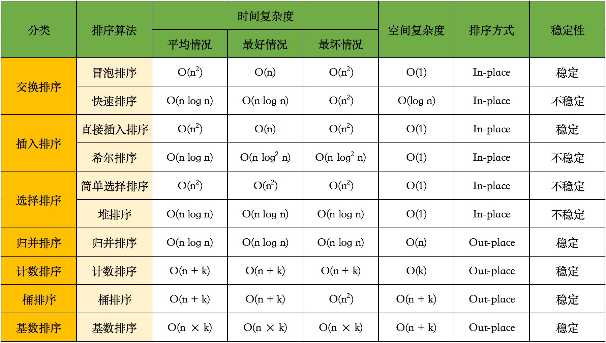

## 排序




### 冒泡排序

```python
def bubbleSort(arr):
    for i in range(len(arr)):
        for j in range(i+1, len(arr)):
            if arr[i] > arr[j]:
                arr[i], arr[j] = arr[j], arr[i]
    return arr
```


### 快速排序

```python
# 哨兵法，空间复杂度：递归O(logn)，存放O(1),
def quickSort(arr):
    def partition(arr, l, r):
        if l >= r:
            return 0
        left, right = l, r
        
        # 选择中间的为哨兵，将哨兵放到数组最前面
        arr[l], arr[int((l+r)/2)] = arr[int((l+r)/2)], arr[l]
        pivot = arr[l]
        
        while l < r:
            while l < r and arr[r] >= pivot:
                r -= 1
            arr[l], arr[r] = arr[r], arr[l]
            while l < r and arr[l] <= pivot:
                l += 1
            arr[l], arr[r] = arr[r], arr[l]
        partition(arr, left, l-1)
        partition(arr, l+1, right)
    
    partition(arr, 0, len(arr)-1)
    return arr


# 简单粗暴法，空间复杂度：递归O(logn)，存放O(log^2 n)？
def quickSort(arr: List[int]) -> List[int]:
    if not arr:
        return []
    pivot = arr[int(len(arr)/2)]
    left = []
    right = []
    middle = []
    for i in arr:
        if i<pivot:
            left.append(i)
        elif i>pivot:
            right.append(i)
        else:
            middle.append(i)
    return quickSort(left) + middle + quickSort(right)
```


### 归并排序

```python
def mergeSort(arr):
    if len(arr) == 1:
        return arr
    m = int(len(arr)/2)
    left = mergeSort(arr[:m])
    right = mergeSort(arr[m:])

    #merge
    i = j = 0
    while(i+j < len(arr)):
        if j == len(right) or (i < len(left) and left[i] < right[j]):
            arr[i+j] = left[i]
            i += 1
        else:
            arr[i+j] = right[j]
            j += 1

    return arr
```


### 堆排序

```python
def heapSort(arr):

    def heapify(arr, arrlen, node):   # node是要维护的节点
        l = 2*node
        r = l+1
        largest = l if (l <= arrlen-1 and arr[l]>arr[node]) else node
        largest = r if (r <= arrlen-1 and arr[r]>arr[largest]) else largest
        if largest != node:
            arr[node], arr[largest] = arr[largest], arr[node]
            heapify(arr, arrlen, largest)
    
    # 自底向上构建最大堆
    i = len(arr)-1
    while(i >= 0):
        heapify(arr, len(arr), i)
        i -= 1
    
    # 开始提取最大值
    arrlen = len(arr)-1  # 代表当前数组长度，arr[arrlen:]已排好序，不需再考虑
    while(arrlen >= 0):
        arr[0], arr[arrlen] = arr[arrlen], arr[0]     # 此时arr[0]为最大值，交换到数组尾
        heapify(arr, arrlen, 0)  # 维护根节点的最大堆
        arrlen -= 1
    return arr
```


### 应用

#### 返回最小的k个数

思路：使用快速排序算法，但仅对前k个进行排序

```python
def get_k_min(arr, k):
    def partition(arr, l, r, k):
        if l >= r:
            return 0
        left = l
        right = r
        pivot = arr[l]
        while l < r:
            while l < r and arr[r] >= pivot:
                r -= 1
            arr[l], arr[r] = arr[r], arr[l]
            while l < r and arr[l] <= pivot:
                l += 1
            arr[l], arr[r] = arr[r], arr[l]
        partition(arr, left, l-1, k)
        if k > l+1:
            partition(arr, l+1, right, k)

    if k==0 or k>len(arr):
        return []
    partition(arr, 0, len(arr)-1, k)
    return arr[:k]
```


#### 返回第k大的数

思路：使用快速排序，每次返回哨兵的最终下标，如果下标=k-1，则该哨兵为第k大的数

```python
def get_kth_max(arr, k):
    
    def partition(arr, l, r):	# 从大到小排序
        if l >= r:
            return l
        pivot = arr[l]
        while l < r:
            while l < r and arr[r] <= pivot:
                r -= 1
            arr[l], arr[r] = arr[r], arr[l]
            while l < r and arr[l] >= pivot:
                l += 1
            arr[l], arr[r] = arr[r], arr[l]
        return l

   
    left, right = 0, len(arr)-1
    if k<=0 or k>len(arr):
        return None
    while(left <= right):
        pivot = partition(arr, left, right)
        if pivot == k-1:
            return arr[pivot]
        elif pivot < k-1:
            left = pivot + 1
        else:
            right = pivot - 1
    return None
```


## 数组与矩阵

### 最长无重复子数组

给定一个长度为n的数组arr，返回arr的最长、无重复、连续的子数组的长度，无重复指的是所有数字都不相同。

思路：

1. 方法一：利用队列先进先出特性，发现元素元素重复则开始逐渐pop出元素，直到队列无重复，最后返回队列长度即可。 

2. 方法二：使用字典记录每个元素的前距离（前距离=坐标+1），使用滑窗法进行计算，window=坐标+1-最大前距离。代码如下：

```python
def maxUniqueLength(arr) -> int:
	longest_length,i = 0,-1
    arr_length = len(arr)
    l_str = {}      # 出现过的字符及其最后出现的位置
    for j in range(arr_length):         # i指针是滑窗左侧，j指针是滑窗右侧，左开右闭
        if arr[j] in l_str and l_str[arr[j]] > i:       # 当前字符在l_str中出现，且最后出现在i~j范围内，才算重复
            i = l_str[arr[j]]
        l_str[arr[j]] = j                               # 更新当前字符最后出现位置
        longest_length = max(longest_length, j-i)
    return max(longest_length, j-i)
```


### 矩阵的最小路径和

给定一个 n * m 的矩阵 a，从左上角开始每次只能向右或者向下走，最后到达右下角的位置，路径上所有的数字累加起来就是路径和，输出所有的路径中最小的路径和。

思路：

1. 方法一：回溯递归。```matrix[i][j]```到终点的最短距离，等于当前点的路径和，加从```matrix[i+1][j]```到终点的最短距离，或加从```matrix[i][j+1]```到终点的最短距离，两者中的更小的那个。
2. 方法二：动态规划。```dp[i][j]```代表起点到```matrix[i][j]```的最短距离，其等于```dp[i-1][j]```和```dp[i][j-1]```的较小值加当前点的数值。由于dp矩阵的第一行和第一列是固定的，在可以先算第一行和第一列，然后再逐行计算。
   - 方法二可继续优化：在动态规划递推过程中，其方向是「从上至下」、「从左至右」，因此可以**直接对原输入数组进行修改**，并不会影响后续的递推过程。空间复杂度从O(mn)降至O(1)。

```python
# 方法一：递归
def minPathSum(matrix, i=0, j=0, cur_sum=0) -> int:
    m = len(matrix)-1
    n = len(matrix[0])-1
    cur_sum += matrix[i][j]
    if i==m and j==n:
        return cur_sum
    p1 = traverse(matrix, i+1, j, cur_sum) if i<m else -1
    p2 = traverse(matrix, i, j+1, cur_sum) if j<n else -1
    return min(p1, p2)

# 方法二：动态规划
def minPathSum(matrix) -> int:
    m = len(matrix)
    n = len(matrix[0]) if matrix else 0
    if m==0 or n==0:
        return 0
    
    dp = [[0] * n for i in range(m)]
    dp[0][0] = matrix[0][0]
    
    for j in range(1, n):	# 计算第一行
        dp[0][j] = matrix[0][j] + dp[0][j-1]
        
    for i in range(1, m):	# 计算第一列
        dp[i][0] = matrix[i][0] + dp[i-1][0]
    
    for i in range(1, m):	# 计算剩余的
        for j in range(1, n):
            dp[i][j] = matrix[i][j] + min(dp[i-1][j], dp[i][j-1])
```


### 旋转矩阵

将矩阵顺时针/逆时针旋转90度。

```python
def rotateMatrix_clockwise(matrix: List[List[int]]) -> List[List[int]]:
    m = len(matrix)
    n = len(matrix[0])
    res = []
    for j in range(n):	# 列：从左到右
        temp = []
        for i in range(m-1, -1, -1):	# 行：从下到上
            temp.append(matrix[i][j])
        res.append(temp)
    return res

def rotateMatrix_anticlockwise(matrix: List[List[int]]) -> List[List[int]]:
    m = len(matrix)
    n = len(matrix[0])
    res = []
    for j in range(n-1, -1, -1):	# 列：从右到左
        temp = []
        for i in range(m):			# 行：从上到下
            temp.append(matrix[i][j])
        res.append(temp)
    return res


# 装逼方法
def rotateMatrix_clockwise(matrix: List[List[int]]) -> List[List[int]]:
	return list(zip(*matrix[::-1]))

def rotateMatrix_anticlockwise(matrix: List[List[int]]) -> List[List[int]]:
	return list(zip(*matrix))[::-1]
```


### 螺旋矩阵

给定一个m x n大小的矩阵（m行，n列），按螺旋的顺序返回矩阵中的所有元素。

```python
def spiralOrder(matrix: List[List[int]]) -> List[int]:
        if not matrix:
            return []
        res = []
        
        # 剩余矩阵的上下左右边界（闭区间）
        top = left = 0
        right = len(matrix[0]) - 1
        bottom = len(matrix) - 1
        
        while top <= bottom and left <= right:
            for i in range(left, right+1):
                res.append(matrix[top][i])
            for i in range(top+1, bottom+1):
                res.append(matrix[i][right])
            for i in range(right-1, left-1, -1):
                if top == bottom:
                    break
                res.append(matrix[bottom][i])
            for i in range(bottom-1, top, -1):
                if left == right:
                    break
                res.append(matrix[i][left])
            top += 1
            right -= 1
            bottom -= 1
            left += 1
        return res

    
# 装逼方法
def spiralOrder2(matrix: List[List[int]]) -> List[int]:
    res = []
    while matrix:
        res += matrix[0]
        matrix = list(zip(*matrix[1:]))[::-1]	# 逆时针旋转90度
    return res
```


## 字符串

### 最长回文字符串的长度

```python
def max_sym_length(s):
    max_length = 1
    for i in range(len(s)):
        j = 0
        # 先默认回文串长度为奇数
        while(i-j-1>=0 and i+j+1<len(s)):
            if s[i-j-1] == s[i+j+1]:
                j += 1
            else:
                break
        max_length = max(max_length, 2*j+1)

        # 如果s[i] == s[i+1]，考虑回文串长度为偶数
        if i+1<len(s) and s[i] == s[i+1]:
            j = 0
            while(i-j-1>=0 and i+2+j<len(s)):
                if s[i-j-1] == s[i+2+j]:
                    j += 1
                else:
                    break
            max_length = max(max_length, 2*j+2)
        
    return max_length
```


### 最长重复子字符串

```python
def maxSameString(s):
    last = ''
    length = maxlen = start = 0       # 由于要返回字符串，还需记录字符串开始位置
    for i in range(len(s)):
        if s[i] == last:            # 如果相同，则继续增加
            length += 1
        else:
            if length > maxlen:       # 如果刷新了长度，更新maxlen，最长字符串开始位置为i-length
                maxlen = length 
                start = i-length             
            last = s[i]
            length = 1
    return s[start:start+maxlen]
```


### 最长公共子串

给定两个字符串str1和str2，输出两个字符串的最长公共子串

思路：

1. 动态规划：定义```dp[i][j]```表示**字符串str1中第i个字符和str2种第j个字符为最后一个元素所构成的最长公共子串**。如果要求```dp[i][j]```，也就是str1的第i个字符和str2的第j个字符为最后一个元素所构成的最长公共子串，我们首先需要判断这两个字符是否相等。

   - 如果不相等，那么他们就不能构成公共子串，也就是
     ```dp[i][j] = 0;```

   - 如果相等，我们还需要计算前面相等字符的个数，其实就是```dp[i-1][j-1]```，所以
     ```dp[i][j] = dp[i-1][j-1] + 1;```

```python
def LCS(str1: str, str2: str) -> str:
    maxLength = maxLastIndex =  0
    m, n = len(str1), len(str2)
    dp = [[0] * (n+1) for i in range(m+1)]
    
    for i in range(1, m+1):
        for j in range(1, n+1):
            if str1[i-1] == str2[j-1]:
                dp[i][j] = dp[i-1][j-1] + 1
                if dp[i][j] > maxLength:
                    maxLength = dp[i][j]
                    maxLastIndex = i
            else:
                dp[i][j] = 0
    return str1[maxLastIndex-maxLength: maxLastIndex]
```

T(n)=O(n^2)，S(n)=O(n^2)，但是这种方法在字符串太长时（几千以上），python的执行时间会超

2. 滑动窗口法：窗口大小即为目前最长公共子串的长度，继续遍历时，只要window+=i后，window出现在str2中，那么window即为新的最长公共子串（前面不可能有比该子串更长）。T(n)=O(n^2)，S(n)=O(1)

```python
def LCS(str1: str, str2: str) -> str:
    window = ''
    res = ''
    
    for i in str1:
        window += i
        if window in str2:
            res = window
        else:
            window = window[1:]
            
    return res
```


## 链表

链表的数据结构

```python
class ListNode:
    def __init__(self, val) -> None:
        self.val = val
        self.next = None
```


### 单链表排序

思路：最简单的方法，遍历链表并放到数组中，在数组里排好序再组成链表。也可以使用归并方法，虽然不会复杂度不会更低。

```python
def sortListNodes(self , head: ListNode) -> ListNode:
    '''
        单链表排序，使用了归并思想
    '''
    if head is None or head.next is None:
        return head
    slow = head
    fast = head.next
    while(slow and fast and fast.next):		# 快慢指针，快指针走完，慢指针到一半
        slow = slow.next
        fast = fast.next.next
    rightHead = slow.next
    slow.next = None
    left = self.sortListNodes(head)
    right = self.sortListNodes(rightHead)
        
    zeroHead = ListNode(-1)
    curr = zeroHead
    while(left and right):
        if left.val<right.val:
            curr.next = left
            left = left.next
        else:
            curr.next = right
            right = right.next
        curr = curr.next
    curr.next = left if left else right
    return zeroHead.next
```


### 翻转链表

```python
def reverse(left, right=None):   # 反转left~right-1链表，返回链头
    '''
    	反转链表的[left, right)区间，返回链头
    	若翻转整个链表，则right=None
    '''
    prev = right
    while(left!=right):
        temp = left.next
        left.next = prev
        prev = left
        left = temp
    return prev
```


### k个一组翻转链表

思路：数出链表的前k个，将边界传给reverse函数，原头结点变为这一组的尾结点，链表的剩余部分重复该步骤（递归）。

```python
def k_reverse(head, k):
    tail = head

    for i in range(k):
        if tail is None:	# 不足k个就不翻转
            return head
        tail = tail.next
    
    res = reverse(head, tail)
    head.next = k_reverse(node, k)      # 翻转后，head实际成为组内的最后一个结点

    return res
```


### 翻转链表指定区间

将一个节点数为 size 链表 m 位置到 n 位置之间的区间反转(m、n从1开始)

```python
def reverseBetween(head: ListNode, m: int, n: int) -> ListNode:
    # 翻转区间为(l,r)
    l = r = None
    node = head
    for i in range(1,n+1):
        if i==m-1:
            l = node
        node = node.next
    r = node
    p = l.next if l else head    # 如果m为1则l为None
    
    prev = r
    while(p!=r):
        temp = p.next
        p.next = prev
        prev = p 
        p = temp
    if l:   			# m>1，将翻转区间前一个的next指向原翻转区间的最后一个结点
        l.next = prev
        return head
    else:   			# m==1，原翻转区间的最后一个结点即为新的链头
        return prev
```


### 判断链表是否有环

```python
def hasCycle_1(head: ListNode) -> bool:
    '''
   		判断链表中是否有环，有返回true，无返回false
    ''' 
    visited = []    # 使用数组记录已遍历的结点
    while(head):
        if head in visited:
            return True
        visited.append(head)
        head = head.next
    return False

def hasCycle_2(head: ListNode) -> bool:
    '''
    	使用快慢指针，如果存在环，在slow遍历完链表前，fast一定会套圈追上slow
    '''
    slow = head
    fast = head
    while fast and fast.next:       # 只需要判断fast是否到达链尾，slow不可能比fast还快
        slow = slow.next
        fast = fast.next.next
        if slow == fast:
            return True
    return False
```


### 找出环的入口结点

给定一条链表，若链表存在环，就请找到环的入口并返回入口的指针；若不存在环就返回null

思路：

1. 方法一：哈希集合。将遍历过的结点放到数组中，第一个碰到已遍历过的结点就是环的入口。T(n)=O(n)，S(n)=O(n)
2. 方法二：快慢指针，T(n)=O(n)，S(n)=O(1)
   - 假设环前节点一共有a个，环中的节点有b个，设fast指针走过的节点数是f，slow指针走过的节点数是s，那么有以下两个结论：
     - ```f = 2 * s``` （即快指针走过的节点数一定是慢指针的两倍）
     - ```f = s + nb``` （当两者相遇时，快指针一定已经绕环走了n圈）
   - 上面可得，```f=2nb, s=nb```，已知我们要走到入口节点，需要走a + kb步，而这时s = nb只要再走a即可到达入口，我们把快指针移动到头节点，然后两个指针一步一步往后走，当它们相遇时所处的位置就是入口节点

```python
def EntryNodeOfLoop(self, pHead):
    slow = fast = pHead
    while fast:
    	slow = slow.next
    	if not fast.next:
            return None
        fast = fast.next.next
        if slow == fast:
        	fast = pHead
            while slow != fast:
            	slow = slow.next
                fast = fast.next
            return fast
    return None
```


## 树

树的数据结构

```python	
from typing import List

class TreeNode:
    def __init__(self, x):
        self.val = x
        self.left = None
        self.right = None
```


### 二叉树的遍历

#### 递归方法

```python
def traversal_recursion(root: TreeNode) -> List[int]:
    '''
        递归方法的前序/中序/后序遍历，有堆栈溢出（递归过深）的风险
    '''
    def preOrder(root, res):
        if root:
            res.append(root.val)
            preOrder(root.left, res)
            preOrder(root.right, res)

    def inorder(root, res):
        if root:
            inOrder(root.left, res)
            res.append(root.val)
            inOrder(root.right, res)

    def postorder(root, res):
        if root:
            postOrder(root.left, res)
            postOrder(root.right, res)
            res.append(root.val)
    
    res = []
    inorder(root, res)
    return res
```


#### 非递归方法

##### 前序遍历

思路：用栈，先将根节点入栈，出栈的同时，先将右子树入栈，再将左子树入栈，循环执行即可

```python
def preOrderTraversal(root: TreeNode) -> List[int]:
    '''
        前序遍历——非递归方法
    '''
    res = []
    stack = []
    if not root:
        return res
    stack.append(root)
    while stack:
        p = stack.pop(-1)
        res.append(p.val)
        if(p.right):
            stack.append(p.right)
        if(p.left):
            stack.append(p.left)
    return res
```


##### 中序遍历

思路：

1. 先一直将左子树加入栈中，直到左结点为空。
2. pop栈中最后一个结点，访问
3. 对它的右子树重新递归，回到步骤1

```python
def inOrderTraversal(root: TreeNode) -> List[int]:
    '''
        中序遍历——非递归方法
    '''
    stack = []      # 栈
    res = []
    p = root
    while True:
        while p:           # 首先将所有左结点加入到栈中
            stack.append(p)
            p = p.left
        if not stack:
            break
        p = stack.pop(-1)   # 取最后一个结点，由于上面能退出while p循环，此结点必定没有左孩子，或已遍历完左子树
        res.append(p.val)   # 取数
        p = p.right         # 遍历右子树，相当于递归了
    return res
```


##### 后序遍历

思路：
        后序遍历的顺序为左、右、根，反过来就是根、右、左，类似先序遍历的根、左、右，
        因此采用与先序遍历的思路：先将根节点入栈，出栈的同时，先将左子树入栈，再将右子树入栈（从而出栈时先右后左）
        最后输出前将数组反过来即可

```python
def postOrderTraversal(root: TreeNode) -> List[int]:
    '''
		后序遍历——非递归方法
    '''
    stack = []
    res = []
    if not root:
        return res
    stack.append(root)
    while stack:
        p = stack.pop(-1)
        res.append(p.val)
        if(p.left):
            stack.append(p.left)
        if(p.right):
            stack.append(p.right)
    res.reverse()
    return res
```


##### 按层遍历

```py
def levelOrderTraversal(root: TreeNode) -> List[List[int]]:
    '''
        按层遍历二叉树，返回[ [第一层], [第二层], ...]
    '''
    que, res = [], []
    if not root:    # 根节点为空直接返回
        return res
    que.append(root)   # 队列保存每一层所有未访问的结点
    while que:
        temp = []		# 放置该层的结果
        nodes_num_of_level = len(que)       # 如果不需要每层生成一个一维数组的话，则不需记录当前层的结点数
        
        for i in range(nodes_num_of_level): # 遍历每一层
            node = que.pop(0)
            temp.append(node.val)
            # 左右节点按顺序加到队尾
            if node.left:
                que.append(node.left)
            if node.right:
                que.append(node.right)

        res.append(temp)
    return res
```


### 二叉树的深度

```python
# 递归方法
def treeDepth(root: TreeNode) -> int:
    if not root:
        depth = 0
    else:
        depthL = treeDepth(root.left)
        depthR = treeDepth(root.right)
        depth = max(depthL, depthR) + 1
    return depth

# 非递归方法  （思路和按层遍历一样）
def treeDepth2(root: TreeNode) -> int:
    depth = 0
    if not root:
        return 0
    que = []
    que.append(root)
    while que:
        nodes_num_of_level = len(que)
        for i in range(nodes_num_of_level):
            node = que.pop(0)
            if node.left:
                que.append(node.left)
            if node.right:
                que.append(node.right)
        depth += 1
    return depth
```


## 其他


### 三数之和

给出一个有n个元素的数组S，S中是否有元素a,b,c满足a+b+c=0？找出数组S中所有满足条件的三元组。

思路：

1. 约定a<=b<=c
2. 将数组排好序，固定a，b和c分别指向a后的一头一尾，若a+b+c<0，b++，若a+b+c>0，c--
3. 当a>0，则b和c必定>0，可退出循环
4. 规避三元组重复：
   - 连续a重复
   - 找到一个三元组后，b和c移动到下一个不相同处

```python
def threeSum(num):
    res = []
    n = len(num)
    if(not num or n<3): 
        return [] 
    num.sort()
    for i in range(n): 
        if(num[i]>0):      # num[i]>0，则右边所有数都大于0，不可能成立
            return res
        if(i>0 and num[i]==num[i-1]):    # i的数与上一个数一致，直接跳过
            continue

        L=i+1
        R=n-1

        while(L<R):
            if num[i]+num[L]+num[R]>0:
                R-=1
            elif num[i]+num[L]+num[R]<0:
                L+=1
            else:
                res.append([num[i], num[L], num[R]])
                while(L+1<R and num[L]==num[L+1]):      # 这里是跳到所有重复数的最后一个
                    L+=1
                while(L<R-1 and num[R]==num[R-1]):
                    R-=1
                L+=1    # 在上面去重后，num[L+1] 必定大于num[L]，因此sum必定大于0，所以R也同时-1
                R-=1
    return res
```


### 两数之和

给出一个整型数组 numbers 和一个目标值 target，请在数组中找出两个加起来等于目标值的数的下标，返回的下标按升序排列。

思路：一个指针从头到尾，遍历过的放在字典中，加快后续查询速度，时间复杂度O(n)

```python
def twoSum(numbers: List, target: int) -> List[int]:
    a = {}
    for i in range(len(numbers)):
        temp = target-numbers[i]
        if temp in a:
            return [a[temp]+1, i+1]         # 这里是返回index+1，视情况返回值
            # return [temp, numbers[i]].sort()
        else:
            a[numbers[i]] = i
    return []
```


## 栈与队列

### 用两个栈实现队列

思路：

1. 当插入时，直接插入 stack1

2. 当弹出时，当 stack2 不为空，弹出 stack2 栈顶元素，如果 stack2 为空，将 stack1 中的全部数逐个出栈入栈 stack2，再弹出 stack2 栈顶元素

```python
class Solution:
    def __init__(self):
        self.stack1 = []
        self.stack2 = []
        
    def push(self, node):
        self.stack1.append(node)
        
    def pop(self):
        if self.stack2:
            return self.stack2.pop(-1)
        else:
            if self.stack1:
                for i in range(len(self.stack1)):
                    self.stack2.append(self.stack1.pop(-1))
                return self.stack2.pop(-1)
            else:
                return None
```

